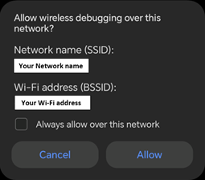
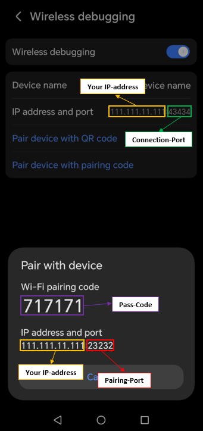

# **Disable-Android-Phantom-process-killer**
### **Prevent Signal 9 (SIGKILL) in Termux on Android**  
### *Increase Background Process Limit & Stop Android’s Aggressive Process Killing*  

---

### **Step-by-Step Guide**  

#### **1. Check battery/power settings** 
Check your device’s **battery/power settings** and exclude Termux from optimization. 
Many OEMs force-kill background apps by default.

#### **2. Install Required Tools**  
In Termux-console run:
```bash
pkg install android-tools
```

#### **3. Enable Developer Options**  
- Go to: **Settings → About Phone → Build Number**  
- Tap "Build Number" **7 times** until "Developer mode enabled" appears.  

#### **4. Activate Wireless Debugging**  
- Connect to a **trusted Wi-Fi** network.  
-  Go to: **Settings → Developer Options** → Enable **"Wireless Debugging"**.  
- Select **Allow** on following prompt:
  


#### **5. Start ADB Server**
In Termux-console run:
```bash
adb start-server
```
#### **6. Pair Device**  
- **IMPORTANT: Use split-screen/multi-window mode**:  
  - **Window 1**: Termux (keep open).  
  - **Window 2**: Open Wireless debunging and press **"Pair device with Pass-Code"**.  
  - **⚠️ Note**: The pairing code expires if you close the window or move it into the background!  



- In Termux-console run:  
```bash
adb pair localhost:<PairingPort> # Or use <YourIP>:<PairingPort>
```
#### **7. Connect via ADB**  
In Termux-console run:
```bash
adb connect localhost:<DebugPort> # Or <YourIP>:<DebugPort>
```
- **Success?** → Proceed.  
- `error: protocol fault (couldn't read status message): Success` → You probably didn’t use multi-window mode!  

#### **8. Increase Phantom Process Limit**  
In Termux-console run:
```bash
adb shell device_config put activity_manager max_phantom_processes 214181594
```
*(Default on most Android is `32`. This sets the max supported value. Lower values like `1024` will very likely also work.)*  

#### **9. Make Changes Persistent**  
 - *Without this, Android resets the limit when ADB disconnects.*

In Termux-console run:
```bash
adb shell device_config set_sync_disabled_for_tests persistent
```

#### **10. Clean Up**  
 - In Termux-console run:
```bash
adb kill-server
````
 - Disable **Wireless Debugging** when done.  

---

### **If you ever want to revert the changes**  
**Run the same steps as above but instead of Step 8 and 9 run in the Termux-console:**
```bash
adb shell device_config set_sync_disabled_for_tests none
```


---

## 💡 My Code Saved You Time or Want to Support?

If my work saved you a headache, feel free to show some numeric-love! ♥

**Support options:**

- [PayPal donation](https://www.paypal.com/donate/?hosted_button_id=CGRG2DCYY2HB2)  

- **Prefer blockchain?**  
  SOLANA address: `ohuHw6XLCLTN9B87yY9J3fGGJKHEdurnswWntAqdhEC`

*Thank you to every supporter-it means a lot to me!*


---
